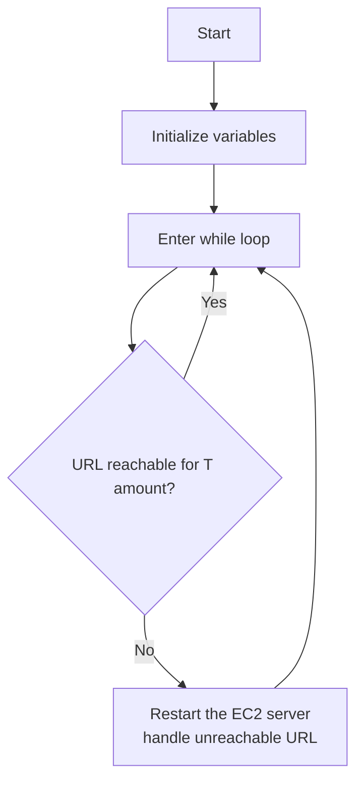

# Droplet Maintainer

This is a simple script that will stop and start Droplet instances if it fails to GET a particular URL. This is useful for maintaining Droplet instances that are not behind a load balancer.


## Flowchart



## Configuration

Since whole point is to maintain Droplet instnace. this is made to be hosted on a different machine. that have no connection to the Droplet instance you are monitoring.

You can get digitalocean_token from [Application & API page](https://cloud.digitalocean.com/account/api/tokens).
```
{
    "i-03cdcee6a9ea8be78": {
        "location": {
            "url": "https://streamsnip.com",
            "headers": {},
            "response_code" : 200,
            "timeout" : 10
        },
        "digitalocean_token": "",
        "interval": 60,
        "tolerance" : 10,
        "discord": "https://discord.com/api/webhooks/1205223388512124990/ub640V3iN-"
    }
}
```


## Installation

```bash
pip install -r requirements.txt
```

## Usage

```bash
python main.py
```

## Crontab
```bash
@reboot cd /root/droplet_maitainer && nohup python3 main.py & 
```

